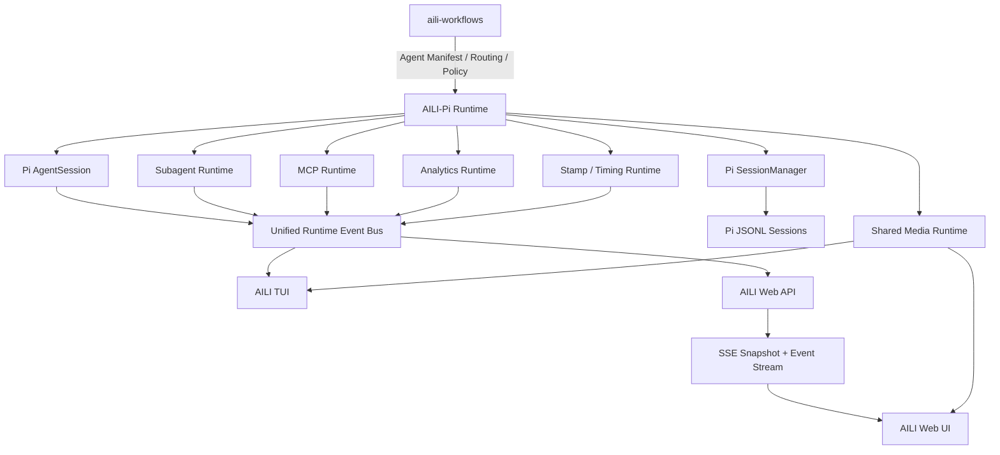

# AILI Web UI 详细设计与实施方案

> 文档状态：Draft  
> 日期：2026-08-12  
> 基础项目：`agegr/pi-web`  
> 视觉参考：Codex、`minghinmatthewlam/pi-gui`  
> 管理交互参考：OpenCode  
> Agent 动效与内容组件：AIcss  
> 所属仓库建议：`aili-pi`  
> 语义配置来源：`aili-workflows`

---

## 1. 项目概述

AILI Web UI 是建立在 Pi Coding Agent 运行时之上的完整浏览器工作台。

它不是对 Pi TUI 的替代，也不是一个重新实现的 Agent Runtime，而是与 TUI 并列的一等交互入口：

```text
                    aili-workflows
                    语义与配置真源
                           │
                           ▼
                       aili-pi
              Pi Runtime / AILI Runtime
                           │
              ┌────────────┴────────────┐
              │                         │
              ▼                         ▼
          Pi / AILI TUI             AILI Web UI
```

最终目标是让用户可以在 TUI 和 Web UI 之间自由选择，并共享：

- Pi Session；
- 对话分支；
- 模型与思考等级；
-上下文状态；
- Subagent；
- MCP Server；
- Tool；
- Skill；
- Extension；
- 文件、Diff 与 Git Worktree；
- Analytics；
- 时间戳和耗时；
- 图片附件；
- AILI Runtime 状态。

TUI 和 Web UI 必须使用同一份运行时状态、同一份 Session JSONL 和同一套 Agent 配置，不能各自维护一套互不一致的数据。

---

## 2. 已确定的核心决策

本项目直接确定以下原则，不再作为待讨论项。

### 2.1 以 `agegr/pi-web` 为功能和代码基础

保留其现有的：

- Session 浏览与恢复；
- Session 分组；
- Pi AgentSession 启动；
- SSE 实时事件；
- Branch 与 Fork；
- Model 与 Provider 管理；
- Skill 与 Plugin 管理；
- 文件浏览；
- 文件预览；
- Git Diff；
- Git Worktree；
- 图片输入；
- Pi 配置共享；
- Session JSONL 读取。

`agegr/pi-web` 当前已经使用浏览器、Next.js Server、进程内 Pi `AgentSession` 和 SSE 事件流组成运行链路；历史 Session 直接读取 JSONL，真正发送消息时才创建 AgentSession。这套边界应当保留。 

当前项目使用 Next.js 16、React 19，并直接依赖对应版本的 Pi Runtime 包。改造后必须统一由 AILI-Pi 控制 Pi 依赖版本，避免 Web UI 与 TUI 使用不同的 Pi 版本。

### 2.2 参考 `pi-gui` 和 Codex 的视觉与信息架构

主要参考：

- Threaded Timeline；
- 紧凑 Tool Card；
- Worktree-per-thread；
- Inline Diff；
- Terminal Dock；
- 多 Agent 编排展示；
- 低噪声界面；
- 清晰的主次层级；
- 克制的颜色和边框；
- 辅助信息通过侧栏查看，而不是打断主会话。

`pi-gui` 本身就是 Codex-style Pi Desktop Shell，并已经实现 Thread Timeline、Worktree、Terminal、Inline Diff 和 Multi-agent Orchestration，因此可以作为交互和视觉参考，但不搬入 Electron、Preload 和 IPC 架构。

### 2.3 使用 AIcss 的全部组件

AIcss 当前覆盖：

- Thinking State；
- Thinking + Reasoning；
- Orbs；
- Web Search；
- File Diff；
- Image Generation；
- Text Response；
- Streaming Text；
- Inline Citations；
- Code Block；
- To-do List；
- Data Table；
- Comparison Table；
- AI Agent Input。

这些组件全部纳入 AILI Web UI，但必须根据具体语义使用，不能为了动画而动画。

### 2.4 Orbs 作为唯一默认思考动画

思考状态使用 AIcss Orbs 页面 Preview 中的默认展示效果。

不在产品中暴露：

- S1–S5；
- G1–G5；
- C1–C5；
- B1–B5；
- M1–M5；

等动画变体选择器。

AILI 只保留一个统一的思考 Orb，保证品牌一致性和界面稳定性。

AIcss 将 Orbs 定义为不会阻塞 Thread 的紧凑型 Agent Activity Indicator，这与 AILI 的主会话 Timeline 很匹配。

### 2.5 左右双侧栏

页面左右两边均设置可折叠、可调整宽度的侧边栏。

左侧默认负责：

- Workspace；
- Project；
- Worktree；
- Session；
- 文件入口；
- 常用功能导航。

右侧默认负责：

- Runtime Overview；
- Subagent；
- MCP；
- Analytics；
- Context；
- Tool；
- Changes；
- 当前选中项目的 Inspector。

两个侧栏都支持完全收起。

### 2.6 最底部固定 Runtime 状态栏

页面最底部始终显示：

- 当前 Provider；
- 当前 Model；
- 当前思考等级；
- Context 已用长度；
- Context 最大长度；
- Context 百分比；
- 输入 Token；
- 输出 Token；
- 当前费用；
- 当前响应耗时；
- Tool Preset；
- 当前 Agent；
- 连接状态。

模型、思考等级和上下文长度不是隐藏在设置里的次要信息，而是每轮工作都应当可见的核心状态。

### 2.7 TUI 和 Web UI 都保留图片输入能力

未来不能因为 Web UI 支持图片，就取消 TUI 的图片能力。

最终应形成：

```text
TUI
├── Pi 原生图片粘贴
└── Browser Image Staging Companion

Web UI
├── Ctrl+V
├── Drag & Drop
└── File Picker

两者
└── Shared Media Layer
```

---

## 3. 产品定位

AILI Web UI 的定位不是普通聊天网页，而是：

> 面向 Pi、AILI Runtime、Subagent 和 MCP 的本地 Agent 工作台。

它需要同时承担四类职责。

### 3.1 Conversation Surface

负责：

- 用户输入；
- Assistant Streaming；
- Thinking；
- Reasoning；
- Tool Call；
- Tool Result；
- 图片与文件；
- 引用；
- Session Branch；
- Fork；
- Compact；
- Queue Next；
- Steer。

### 3.2 Runtime Observatory

负责：

- 当前 Agent 状态；
- Subagent 状态；
- MCP 状态；
- Tool 使用；
- Provider 可靠性；
- Token 与费用；
- Context；
- 时间戳；
- 各阶段耗时；
- 错误和重试。

### 3.3 Workspace Surface

负责：

- Project；
- Worktree；
- Branch；
- File Tree；
- 文件预览；
- Diff；
- Changed Files；
- 后续的 Terminal。

### 3.4 Configuration Surface

负责：

- Provider；
- Model；
- Skill；
- Extension；
- MCP；
- Agent Profile；
- Tool Preset；
- Theme；
- Analytics；
- Web UI 设置。

---

## 4. 总体技术架构



### 4.1 Source of Truth

不同数据必须明确唯一真源。

| 数据 | 唯一真源 |
|---|---|
| 历史 Session | Pi JSONL |
| 当前 AgentSession | Pi Runtime |
| Agent 定义 | `aili-workflows` 生成的 Manifest |
| Agent 实际运行状态 | `aili-pi` Subagent Runtime |
| MCP 配置 | Pi/AILI MCP Runtime 配置 |
| MCP 实际连接状态 | MCP Runtime |
| Analytics | 本地 Content-free Analytics Store |
| Model、Auth、Provider | Pi Runtime 配置 |
| 文件和 Git | 实际工作目录 |
| Web UI 布局偏好 | 浏览器 Local Storage 或 Web UI 设置 |
| 图片附件 | Shared Media Runtime |

Web UI 不得自行推断 Agent 是否正在运行，也不能仅根据某条 Tool Call 文本猜测 MCP 来源。

---

## 5. 页面总体结构

### 5.1 桌面端布局

```text
┌──────────────────────────────────────────────────────────────────────────┐
│ AILI   Workspace / Worktree / Branch        Search / Command / Settings │
├───────────────┬───────────────────────────────────────┬──────────────────┤
│               │                                       │                  │
│ LEFT SIDEBAR  │              TIMELINE                 │ RIGHT SIDEBAR    │
│               │                                       │                  │
│ Workspaces    │ User                                  │ Overview         │
│ Projects      │ Assistant                             │ Agents           │
│ Worktrees     │ Thinking                              │ MCP              │
│ Sessions      │ Tool Calls                            │ Analytics        │
│ Files         │ Subagents                             │ Context          │
│               │ Results                               │ Changes          │
│               │                                       │ Inspector        │
│               ├───────────────────────────────────────┤                  │
│               │ Composer / Attachments / Commands     │                  │
├───────────────┴───────────────────────────────────────┴──────────────────┤
│ Model · Thinking · Context · Tokens · Cost · Duration · Tools · Agent   │
└──────────────────────────────────────────────────────────────────────────┘
```

### 5.2 布局层级

页面分为五层：

1. 顶部全局栏；
2. 左侧导航栏；
3. 中央 Session Timeline；
4. 右侧 Runtime Inspector；
5. 最底部 Runtime 状态栏。

中央输入框位于 Timeline 底部、Runtime 状态栏上方。

---

## 6. 顶部全局栏

顶部栏保持克制，不堆积运行信息。

### 6.1 左侧区域

显示：

- AILI Logo；
- 当前 Project；
- 当前 Worktree；
- 当前 Git Branch；
- Dirty 状态。

示例：

```text
AILI    imt-api / feature/model-routing
```

点击 Project 名称打开 Workspace Switcher。

### 6.2 中间区域

提供全局搜索和命令面板入口：

```text
Search files, commands, sessions...
```

命令面板参考 OpenCode，支持搜索：

- Session；
- Project；
- File；
- Command；
- Model；
- Agent；
- MCP；
- Skill；
- Extension；
- Worktree。

### 6.3 右侧区域

仅保留：

- 当前运行数量；
- 全局错误提示；
- 左侧栏切换；
- 右侧栏切换；
- 设置；
- 用户主题。

示例：

```text
Agents 2 · Errors 0      ◧ ◨ ⚙
```

---

## 7. 左侧侧边栏

### 7.1 默认宽度

- 默认宽度：280px；
- 最小宽度：220px；
- 最大宽度：420px；
- 收起后宽度：44px；
- 支持拖动调整宽度；
- 宽度保存到浏览器；
- 支持快捷键切换。

建议快捷键：

```text
Ctrl/Cmd + B       切换左侧栏
Ctrl/Cmd + Shift+B 切换右侧栏
```

### 7.2 左侧栏内容

默认分为以下区域。

#### Workspace

```text
WORKSPACES

imt-api
aili-pi
aili-workflows
```

#### Worktrees

```text
WORKTREES

● main
○ feature/web-ui
○ review/pr-2998
```

显示：

- Branch；
- Dirty 状态；
- 是否当前；
- 是否存在正在运行的 Session；
- 是否存在 Subagent。

#### Sessions

```text
SESSIONS

Today
● AILI Web UI 设计
◉ MCP 适配检查
○ Subagent 重构

Yesterday
○ Compaction investigation
```

Session 行展示：

- 标题；
- 时间；
- 运行状态；
- Context 百分比；
- 是否有未读结果；
- 是否有活跃 Subagent；
- 错误状态。

#### Views

```text
VIEWS

Chat
Files
Changes
Analytics
Agents
MCP
Settings
```

这些入口不一定跳转到新页面，也可以切换右侧 Inspector 的默认面板。

### 7.3 收起状态

收起后只显示图标 Rail：

```text
⌂
◫
⎇
▤
⌁
◉
⚙
```

图标 Hover 时显示 Tooltip。

有活跃任务时显示 Badge：

```text
Agents  2
MCP     !
```

---

## 8. 右侧侧边栏

右侧栏是统一的 Runtime Inspector。

### 8.1 默认宽度

- 默认宽度：340px；
- 最小宽度：280px；
- 最大宽度：520px；
- 收起后宽度：44px；
- 支持拖动；
- 支持固定面板；
- 支持临时 Inspector；
- 布局持久化。

### 8.2 右侧栏一级标签

```text
Overview
Agents
MCP
Analytics
Context
Changes
Inspector
```

在空间不足时使用图标标签。

### 8.3 Overview

显示当前 Session 最重要的运行数据。

```text
SESSION OVERVIEW

Status          Running
Started         19:42:11
Elapsed         01:24
Model           GPT-5.6
Thinking        High
Context         42.8k / 128k
Input           18.4k
Output          3.2k
Cost            $0.184
Tools           14 calls
Subagents       2 running
MCP             3 connected
```

### 8.4 Inspector 行为

点击 Timeline 中不同内容，右侧自动进入对应 Inspector：

| 点击内容 | Inspector |
|---|---|
| Subagent Card | Agent Inspector |
| MCP Tool | MCP Tool Inspector |
| 普通 Tool | Tool Inspector |
| 文件 | File Inspector |
| Diff | Diff Inspector |
| 图片 | Media Inspector |
| Context Meter | Context Inspector |
| Provider Error | Provider Error Inspector |

用户可以将 Inspector 固定，避免点击其他内容时被替换。

---

## 9. 最底部 Runtime 状态栏

最底部状态栏是整个产品的重要组成部分。

### 9.1 固定位置

- 固定在窗口最底部；
- 始终可见；
- 不随 Timeline 滚动；
- 左右侧栏收起时仍保留；
- 窗口较窄时允许横向压缩和 Overflow Menu。

### 9.2 默认字段

```text
OpenAI · GPT-5.6 Terra
Thinking: High
Context: 42.8k / 128k · 33%
In: 18.4k
Out: 3.2k
$0.184
18.7s
Tools: Full
Agent: Main
SSE: Connected
```

### 9.3 字段交互

#### Model

点击后打开 Model Selector：

```text
OpenAI
  GPT-5.6 Terra
  GPT-5.6 Luna

Anthropic
  Claude Sonnet 5
```

必须显示：

- Provider；
- Model；
- Context；
- 是否支持图片；
- 是否支持 Reasoning；
- 当前认证状态。

#### Thinking

点击后选择：

```text
Off
Minimal
Low
Medium
High
XHigh
Max
```

当前 Model 不支持的等级不显示或禁用。

#### Context

显示：

```text
42.8k / 128k · 33%
```

状态分级：

- 正常；
- 接近 Compact；
- 高风险；
- Overflow Recovery。

点击打开 Context Inspector：

```text
System            8.2k
Tools             12.4k
Conversation      19.1k
Attachments        3.1k
Total             42.8k
Remaining         85.2k
```

#### Tokens

显示本轮和 Session 累计值：

```text
In 18.4k · Out 3.2k
```

Hover 后显示：

```text
Current response
Input        18,421
Output        3,191

Session
Input       148,204
Output       31,482
```

#### Cost

显示：

```text
$0.184
```

Hover 显示：

- 本轮费用；
- Session 累计；
- 今日累计；
- 计费来源；
- 是否估算。

#### Duration

工作中显示动态耗时：

```text
18.7s
```

完成后固定最终耗时。

Hover 展示：

```text
Queued             0.2s
Provider wait      1.1s
First content      1.4s
Tool time         12.8s
Total             18.7s
```

#### Tools

显示当前 Tool Preset：

```text
Tools: Full
```

点击可切换：

```text
None
Read Only
Default
Full
Custom
```

#### Agent

显示：

```text
Agent: Main
```

存在子 Agent 时：

```text
Agent: Main · 2 active
```

点击打开 Agents 面板。

#### Connection

显示：

```text
SSE: Connected
```

异常状态：

```text
Reconnecting
Stale
Offline
Runtime unavailable
```

---

## 10. 中央 Timeline

### 10.1 Timeline 原则

Timeline 采用 Codex/pi-gui 风格：

- 主消息宽度合理；
- Tool 默认折叠；
- 运行状态清晰；
- 不堆叠大面积彩色卡片；
- Tool、Subagent、Reasoning 均属于 Assistant Turn；
- 同一 Turn 内形成结构化步骤；
- 已完成步骤自动降低视觉权重；
- 错误和阻塞保持醒目；
- 用户可以一键展开全部步骤。

### 10.2 Assistant Turn 结构

```text
Assistant Turn
├── Thinking
├── Reasoning Summary
├── Tool Calls
├── Subagent Activity
├── MCP Activity
├── Todo / Plan
├── Streaming Response
└── Final Response
```

### 10.3 时间戳

每一条消息显示时间戳。

#### 用户消息

```text
You                                      19:42:11
```

#### Assistant 消息

```text
AILI                         19:42:13 · 18.7s
```

#### Tool

```text
read src/auth.ts              19:42:16 · 0.3s
```

#### Subagent

```text
Reviewer                     19:42:18 · 32.4s
```

时间格式默认：

```text
HH:mm:ss
```

跨天时显示：

```text
2026-08-12 19:42:11
```

### 10.4 耗时字段

所有 Timeline 单元统一支持：

```ts
interface TimelineTiming {
  createdAt: string;
  queuedAt?: string;
  startedAt?: string;
  firstContentAt?: string;
  settledAt?: string;
  durationMs?: number;
  queueDurationMs?: number;
  firstContentDurationMs?: number;
}
```

时间戳和耗时只属于 UI Metadata，绝不能进入发送给模型的上下文。

---

## 11. AIcss 组件完整使用映射

### 11.1 Thinking State

使用位置：

- 普通思考状态；
- 非 Reasoning Model 的等待状态；
- 短时间处理状态。

示例：

```text
Thinking…
```

### 11.2 Thinking + Reasoning

使用位置：

- Provider 返回的 reasoning summary；
- Provider 返回的 reasoning content；
- AILI 自己生成的公开执行说明；
- Plan 模式中的公开推理摘要。

不得显示：

- 系统未公开的隐藏 Chain of Thought；
- 内部安全策略；
- Runtime 私有 Prompt；
- Credential。

默认折叠，用户点击后展开。

### 11.3 Orbs

Orbs 是唯一默认思考动画。

使用位置：

```text
[Orb] Thinking
```

可根据状态修改旁边文字：

```text
Thinking
Planning
Analyzing
Reviewing
Synthesizing
Finalizing
```

Orb 本身保持同一种 Preview 样式，不切换几十种动画变体。

### 11.4 Web Search

适配：

- Web Search Tool；
- Firecrawl；
- 浏览器研究；
- 搜索型 MCP；
- GitHub Search。

显示：

```text
Searching “Pi Web MCP interface”
```

结果折叠显示：

```text
3 sources
```

### 11.5 File Diff

适配：

- `write`；
- `edit`；
- `str_replace`；
- MCP Edit；
- Subagent Artifact Diff；
- Git Diff。

Timeline 只展示紧凑 Diff，完整 Diff 在右侧 Inspector。

### 11.6 Image Generation

适配：

- 图片生成 Tool；
- 图片编辑；
- Screenshot；
- Browser capture；
- Visual artifact。

### 11.7 Text Response

用于已经完成的 Assistant 最终回复。

### 11.8 Streaming Text

用于实时 Streaming。

要求：

- 支持 Markdown 增量渲染；
- 避免每个 Token 触发完整 Markdown 重算；
- 保持滚动位置；
- 用户向上阅读时不强制跳到底部。

### 11.9 Inline Citations

用于：

- Web Research；
- 文件引用；
- GitHub 引用；
- MCP Resource 引用；
- Documentation 引用。

### 11.10 Code Block

用于：

- Assistant Code；
- Tool Output；
- Config；
- Shell；
- JSON；
- Diff。

支持：

- Copy；
- Wrap；
- Line number；
- File name；
- Language；
- Add to context；
- Open file。

### 11.11 To-do List

用于：

- Goal；
- Plan；
- Workflow；
- Subagent Work Item；
- Verification Checklist。

示例：

```text
Implementation 3/5

✓ Define runtime contract
✓ Add event projection
✓ Add Subagent summary
○ Add MCP inspector
○ Add reconnect tests
```

### 11.12 Data Table

用于：

- Analytics；
- Tool statistics；
- Provider reliability；
- MCP Tool 列表；
- Agent usage；
- Model usage。

### 11.13 Comparison Table

用于：

- Model 比较；
- Provider 比较；
- Agent Panel Review；
- Subagent 结果比较；
- Worktree 状态比较。

### 11.14 AI Agent Input

作为 Composer 的视觉基础，但需要扩展：

- Slash Command；
- `@file`；
- `@agent`；
- `@skill`；
- 图片；
- 文件；
- Queue Next；
- Steer；
- Stop；
- Model；
- Thinking；
- Tool Preset。

---

## 12. Composer 设计

### 12.1 Composer 结构

```text
┌──────────────────────────────────────────────────────┐
│ Attachments / Context Chips                          │
│                                                      │
│ Ask AILI...                                          │
│                                                      │
│ +  @  /               Queue Next  Steer      Send ↑  │
└──────────────────────────────────────────────────────┘
```

模型、Thinking 和 Context 不放在 Composer 内部，而放在其下方的固定 Runtime 状态栏。

### 12.2 输入能力

支持：

- 多行文本；
- Markdown；
- Slash Command；
- 文件 Mention；
- Agent Mention；
- Skill Mention；
- MCP Tool Mention；
- 图片粘贴；
- 图片拖拽；
- 文件拖拽；
- Prompt History；
- Draft Persistence；
- IME；
- Undo/Redo。

### 12.3 忙碌时行为

Agent 工作中，主按钮变为：

```text
Queue Next
```

同时提供独立：

```text
Steer
```

不能把 Queue 和 Steer 混成一个不明确的按钮。

---

## 13. Subagent 展示方案

Subagent 是 AILI Web UI 的一等能力，不能只是普通 Tool Call。

### 13.1 支持的 Agent 类型

Web UI 需要兼容：

- Blocking Agent；
- Detached Agent；
- Retained Agent；
- Consultation；
- Auto Delegation；
- Parallel；
- Chain；
- Workflow；
- Panel Review；
- Aggregator；
- Planner；
- Scout；
- Reviewer；
- Worker；
- 用户自定义 Agent；
- Project Agent。

### 13.2 Agent 状态

统一状态枚举：

```ts
type AgentRunStatus =
  | "planned"
  | "queued"
  | "starting"
  | "running"
  | "waiting"
  | "blocked"
  | "completed"
  | "failed"
  | "cancelled"
  | "interrupted"
  | "stale";
```

### 13.3 Timeline Agent Card

默认折叠：

```text
┌──────────────────────────────────────────────┐
│ [Orb] Reviewer                     Running   │
│ Review current routing changes               │
│ 12 files · 8.4k tokens · 31s                 │
└──────────────────────────────────────────────┘
```

完成：

```text
┌──────────────────────────────────────────────┐
│ ✓ Reviewer                       Completed   │
│ 2 blockers · 3 recommendations · 42.8s       │
└──────────────────────────────────────────────┘
```

失败：

```text
┌──────────────────────────────────────────────┐
│ ! Worker                            Failed   │
│ Child process exited unexpectedly             │
│ View diagnostics                               │
└──────────────────────────────────────────────┘
```

### 13.4 Agent Inspector

点击 Agent Card 后，右侧显示：

```text
REVIEWER

Status          Running
Mode            Panel
Lifecycle       Detached
Transport       RPC
Parent          Main
Model           GPT-5.6
Thinking        High
Workspace       /repo
Worktree        feature/web-ui
Started         19:42:18
Elapsed         00:42
Turns           4 / 12
Tools           16 / 64
Input           8.4k
Output          1.7k
Cost            $0.041
```

下方显示：

- Current Activity；
- Recent Tools；
- Artifacts；
- Verification；
- Claims；
- Limitations；
- Mailbox；
- Completion Delivery；
- Definition Revision；
- Runtime Revision；
- Semantic Skew。

### 13.5 Agent 树

右侧 Agents 面板：

```text
Main Agent
├── Scout                 Completed
├── Reviewer              Running
└── Worker                Running
    └── Test Reviewer     Queued
```

第一版不做大型关系图。

树形列表比可视化拓扑更适合日常使用。

### 13.6 Child Transcript

Retained Agent 或独立 Child Session 可以打开自己的 Transcript。

导航：

```text
Main Session
  → Reviewer
  → Back to Main
```

默认情况下 Child Session 只读。

是否允许继续 Prompt，由 Runtime Capability 决定，不能由 Web UI 自行假设。

### 13.7 无 Subagent 的状态

参考 OpenCode 的 Empty State：

```text
AGENTS

No subagents

Subagents will appear here when AILI
delegates work to another agent.
```

不显示无意义的“大号创建 Agent”按钮。

---

## 14. MCP 展示方案

### 14.1 MCP 是独立运行时资源

不能仅将 MCP Tool 当成普通 Tool Name。

Web UI 必须知道：

- Server；
- Transport；
- Scope；
- Status；
- Tool；
- Resource；
- Prompt；
- Latency；
- Error；
- Context Footprint；
- 当前 Session 是否使用。

### 14.2 MCP Server 状态

```ts
type McpServerStatus =
  | "disabled"
  | "connecting"
  | "connected"
  | "degraded"
  | "error"
  | "disconnected";
```

### 14.3 MCP 面板

```text
MCP SERVERS

● GitHub
  Connected · 24 tools · 183ms

● Context7
  Connected · 3 tools · 94ms

○ Playwright
  Disabled · 18 tools

! Memory
  Error · Connection refused
```

### 14.4 MCP Server Inspector

```text
GITHUB

Status          Connected
Transport       Remote
Scope           Global
Tools           24
Resources       0
Prompts         0
Latency         183ms
Used this turn  3
Schema tokens   ~12.4k
```

下方列出 Tool：

```text
search_code
get_file
get_pull_request
create_issue
...
```

### 14.5 Context Footprint

为 MCP 增加 Tool Schema 大小估算。

示例：

```text
Context impact: High
Estimated schema: 12.4k tokens
```

这个值必须标记为估算，不能冒充 Provider 实际计费值。

### 14.6 Timeline 中的 MCP Tool

显示为：

```text
GitHub · search_code
```

而不是：

```text
mcp_github_search_code
```

Tool Card 中明确展示：

- MCP Server；
- Tool；
- 输入摘要；
- 时间戳；
- 耗时；
- 成功/失败；
- 输出摘要。

### 14.7 无 MCP 的状态

```text
MCP

No MCP servers configured

Configured servers and their tools
will appear here.
```

第一版可以只读展示。

启用、停用和编辑配置可以在后续版本开放。

---

## 15. Analytics 侧边栏

`pi-analytics` 的核心特点是本地优先、只记录无正文 Metadata，统计 Response Cycle、LLM Calls、Skills、Tools 和 Provider Error。AILI Web UI 应保持同样的隐私边界。

### 15.1 Analytics 时间范围

```text
Current Turn
Current Session
Today
7 Days
30 Days
All Time
```

### 15.2 Overview

```text
ANALYTICS · CURRENT SESSION

Response cycles        14
LLM calls              31
Calls / response       2.21
Tool calls             74
Tool errors             2
Subagent runs           6
MCP calls              11
Provider errors         3
Recovered errors        2
Input tokens        148.2k
Output tokens        31.4k
Cost                 $2.81
Active time          38m 14s
```

### 15.3 Analytics 标签

```text
Overview
Responses
Models
Tools
Skills
Agents
MCP
Providers
Context
```

### 15.4 Tool Analytics

```text
Tool              Calls   Errors   Avg      P95
read                42       0     182ms    410ms
bash                11       1      3.2s     8.4s
edit                 8       0     421ms    920ms
search_code          7       1      1.4s     3.1s
```

### 15.5 Agent Analytics

```text
Agent       Runs   Success   Avg time   Tokens   Cost
Scout          8      100%      24.1s    42.1k   $0.42
Reviewer       4       75%      61.2s    38.2k   $0.91
Worker         6       83%     122.4s    91.4k   $1.84
```

### 15.6 Provider Reliability

显示：

- HTTP 429；
- HTTP 5xx；
- Timeout；
- Connection；
- TLS；
- Provider Error；
- Recovered；
- Terminal Failure；
- 平均首 Token 时间；
- 平均响应总时长。

---

## 16. 时间戳与耗时系统

`pi-stamp` 已证明时间戳、Response Timing、Model Metadata、Usage、Cost 和 Tool Duration 可以独立于 LLM Context 存储和显示。AILI Web UI 应吸收这种设计。

### 16.1 需要记录的时间

#### Session

- 创建时间；
- 最近活动时间；
- 总活跃时间。

#### Response Cycle

- 接收用户输入；
- Agent Start；
- Provider Request；
- First Content；
- Tool Start；
- Tool End；
- Agent End；
- Agent Settled。

#### Subagent

- Planned；
- Queued；
- Started；
- First Activity；
- Completed；
- Delivered。

#### MCP

- 请求开始；
- 连接等待；
- 响应结束。

### 16.2 耗时定义

```ts
interface ResponseTiming {
  queuedMs?: number;
  startupMs?: number;
  providerWaitMs?: number;
  firstContentMs?: number;
  toolExecutionMs?: number;
  subagentWaitMs?: number;
  totalMs: number;
}
```

### 16.3 UI 展示层级

Timeline 默认只显示：

```text
19:42:13 · 18.7s
```

Hover 或 Inspector 展示完整拆分。

---

## 17. Context Inspector

Context 是右侧栏的重要一级面板。

### 17.1 总览

```text
CONTEXT

Used             42.8k
Limit           128.0k
Remaining        85.2k
Usage               33%
Compact threshold   80%
```

### 17.2 构成

```text
System             8.2k
Tools             12.4k
Conversation      18.1k
Files              2.4k
Images             1.7k
Agent context       0.0k
```

### 17.3 Compact 状态

显示：

- Native；
- Codex Remote V2；
- Pending；
- Running；
- Fallback；
- Last Compact；
- Tokens Before；
- Tokens After；
- Checkpoint Compatibility。

### 17.4 高风险提示

```text
Context usage is approaching the compact threshold.
```

或：

```text
Remote compaction failed.
Pi-native compaction was used.
```

不能把 fallback 隐藏起来。

---

## 18. Shared Media 和图片输入

### 18.1 Shared Media Layer

建议抽出：

```text
packages/media/
├── image-validation.ts
├── image-processing.ts
├── image-policy.ts
├── attachment-store.ts
├── metadata-strip.ts
├── media-events.ts
└── pi-attachment-adapter.ts
```

### 18.2 TUI 图片入口

TUI 保留：

```text
/image
```

或：

```text
/image-drop
```

打开轻量 Browser Staging Page。

该页面只管理图片，不承担聊天：

```text
Windows Browser
├── Ctrl+V
├── Drag & Drop
├── File Picker
├── Preview
└── Reorder

            ↓

AILI TUI 下一条消息
```

### 18.3 Web UI 图片入口

Web UI Composer 直接支持：

- Ctrl+V；
- Drag & Drop；
- File Picker；
- Preview；
- Reorder；
- Remove；
- Retry；
- Metadata Strip；
- Resize；
- Provider Policy Validation。

### 18.4 共享原则

TUI Companion 和 Web UI 不得各自维护：

- 图片格式判断；
- Resize；
- Metadata Strip；
- Provider Limit；
- Attachment Encoding。

这些必须调用 Shared Media Layer。

---

## 19. `pi-btw` 在 Web UI 中的表现

`pi-btw` 作为旁路问题能力，不应进入主 Session Timeline。

建议在右侧栏提供：

```text
BTW
```

打开临时 Side Thread Drawer。

```text
┌────────────────────────────┐
│ BTW · Side Thread          │
│                            │
│ What does this error mean? │
│                            │
│ The error indicates...     │
│                            │
│ Ask a follow-up...         │
└────────────────────────────┘
```

支持：

- 新建 Side Thread；
- 恢复当前 Session 内存中的 Side Thread；
- 独立 Model；
- 独立 Thinking；
- Quote into Draft；
- 完全不写入主会话。

---

## 20. Git、Diff 和 Worktree

### 20.1 Worktree

保留 `agegr/pi-web` 现有 Worktree 能力，并吸收 `pi-worktree` 更严格的安全检查。

左侧栏 Worktree 显示：

```text
main
feature/web-ui
review/pr-2998
```

### 20.2 Thread 与 Worktree

新建 Session 时提供：

```text
Workspace
├── Current
└── New Worktree
```

Subagent 使用 Worktree 时也应显示对应 Worktree。

### 20.3 Changes

右侧 Changes 面板：

```text
CHANGES

M src/runtime/events.ts       +42 -11
A src/web/agents-panel.tsx    +281
D src/legacy/sidebar.tsx      -194
```

点击文件在 Inspector 查看 AIcss File Diff。

---

## 21. 视觉系统

### 21.1 风格目标

整体风格：

- Codex 式克制；
- pi-gui 式 Timeline；
- OpenCode 式管理；
- AIcss 式 Agent 动效；
- AILI 自己的品牌识别。

### 21.2 色彩

使用中性背景和单一品牌强调色。

品牌色仅用于：

- Active；
- Running；
- Selection；
- Primary Action；
- Orb；
- Focus Ring。

状态颜色只用于：

- Success；
- Warning；
- Error；
- Disabled。

不得让每种 Tool 使用不同的大面积背景色。

### 21.3 边框和层级

优先使用：

- 细边框；
- 轻阴影；
- Surface 层级；
- 留白；
- Typography。

避免：

- 大量玻璃拟态；
- 大面积渐变；
- 每条 Tool 都是厚重卡片；
- 过多圆角；
- 频繁发光。

### 21.4 Typography

建议：

```text
UI：系统 Sans
Code：系统 Mono / JetBrains Mono 类字体
```

主回复字号略大于 Metadata。

Metadata 使用更弱的对比度，但仍保证可读性。

---

## 22. 动画规范

### 22.1 Agent 动画

AIcss 动画主要用于：

- Thinking；
- Reasoning 展开；
- Searching；
- Diff 出现；
- Image Generation；
- Streaming；
- Todo 状态改变；
- Data Table 更新；
- Composer 状态。

### 22.2 普通界面动画

普通界面仅使用：

- 侧栏收起；
- Inspector 切换；
- Modal；
- Tab；
- Toast；
- Hover；
- Badge 更新。

时长控制在轻量范围。

### 22.3 Reduced Motion

必须支持：

```css
@media (prefers-reduced-motion: reduce)
```

Reduced Motion 下：

- Orb 变为静态状态图标；
- Streaming 不使用复杂位移动画；
- Sidebars 使用无动画切换；
- 不影响状态可读性。

### 22.4 性能要求

动画必须：

- 优先使用 transform 和 opacity；
- 避免持续触发布局；
- 不因多个 Subagent 同时运行而产生大量独立高频动画；
- 后台 Tab 暂停非必要动画；
- Timeline 不可见区域停止动画。

---

## 23. Runtime Event Contract

不能让 Web UI 直接依赖某个插件的私有对象。

应建立统一、版本化事件协议。

```ts
interface RuntimeEvent<T = unknown> {
  version: 1;
  sequence: number;
  timestamp: string;

  sessionId: string;
  runId?: string;
  parentRunId?: string;

  source:
    | "pi"
    | "aili"
    | "subagent"
    | "mcp"
    | "analytics"
    | "media";

  type: string;
  payload: T;
}
```

### 23.1 核心事件

```text
session.started
session.replaced
session.settled
session.compaction.started
session.compaction.completed

response.started
response.first_content
response.completed
response.failed

tool.started
tool.progress
tool.completed
tool.failed

agent.planned
agent.queued
agent.started
agent.progress
agent.waiting
agent.blocked
agent.completed
agent.failed
agent.cancelled

mcp.server.connected
mcp.server.disconnected
mcp.server.error
mcp.tool.started
mcp.tool.completed
mcp.tool.failed

analytics.updated
context.updated
usage.updated
media.updated
```

### 23.2 Snapshot + Events

Web UI 首次打开时读取 Snapshot：

```text
GET /api/aili/runtime/:sessionId
```

之后订阅：

```text
GET /api/aili/runtime/:sessionId/events
```

必须支持：

- Sequence；
- Cursor；
- Reconnect；
- Gap Detection；
- Snapshot Replacement；
- Old Event Rejection。

这与 `agegr/pi-web` 当前 SSE 重连和运行状态 reconciliation 的思路保持一致。

---

## 24. API 设计

建议新增以下 API。

### Runtime

```text
GET /api/aili/runtime/:sessionId
GET /api/aili/runtime/:sessionId/events
```

### Agents

```text
GET  /api/aili/agents/:sessionId
GET  /api/aili/agents/:sessionId/:agentId
POST /api/aili/agents/:sessionId/:agentId/cancel
POST /api/aili/agents/:sessionId/:agentId/message
```

控制类 API 必须根据 Runtime Capability 开放。

### MCP

```text
GET  /api/aili/mcp
GET  /api/aili/mcp/:serverId
POST /api/aili/mcp/:serverId/enable
POST /api/aili/mcp/:serverId/disable
POST /api/aili/mcp/:serverId/reconnect
```

第一版可只实现 GET。

### Analytics

```text
GET /api/aili/analytics
GET /api/aili/analytics/session/:sessionId
```

### Media

```text
POST   /api/aili/media
DELETE /api/aili/media/:attachmentId
GET    /api/aili/media/:attachmentId/preview
```

---

## 25. 前端组件结构

建议将 `agegr/pi-web` 重组为：

```text
apps/web/
├── app/
│   ├── api/
│   ├── workspace/
│   ├── session/
│   └── settings/
│
├── components/
│   ├── shell/
│   │   ├── AppShell.tsx
│   │   ├── TopBar.tsx
│   │   ├── LeftDock.tsx
│   │   ├── RightDock.tsx
│   │   └── RuntimeStatusBar.tsx
│   │
│   ├── timeline/
│   │   ├── Timeline.tsx
│   │   ├── Turn.tsx
│   │   ├── Message.tsx
│   │   ├── ToolCard.tsx
│   │   ├── McpToolCard.tsx
│   │   ├── AgentCard.tsx
│   │   └── TimingMetadata.tsx
│   │
│   ├── composer/
│   │   ├── Composer.tsx
│   │   ├── AttachmentTray.tsx
│   │   ├── MentionMenu.tsx
│   │   └── CommandMenu.tsx
│   │
│   ├── agents/
│   │   ├── AgentsPanel.tsx
│   │   ├── AgentTree.tsx
│   │   ├── AgentInspector.tsx
│   │   └── AgentTranscript.tsx
│   │
│   ├── mcp/
│   │   ├── McpPanel.tsx
│   │   ├── McpServerRow.tsx
│   │   └── McpInspector.tsx
│   │
│   ├── analytics/
│   │   ├── AnalyticsPanel.tsx
│   │   ├── OverviewMetrics.tsx
│   │   ├── ToolsTable.tsx
│   │   ├── AgentsTable.tsx
│   │   └── ProviderReliability.tsx
│   │
│   ├── context/
│   │   ├── ContextMeter.tsx
│   │   └── ContextInspector.tsx
│   │
│   ├── media/
│   ├── files/
│   ├── changes/
│   └── settings/
│
├── components/aicss/
│   ├── Orb.tsx
│   ├── ThinkingState.tsx
│   ├── ThinkingReasoning.tsx
│   ├── WebSearch.tsx
│   ├── FileDiff.tsx
│   ├── ImageGeneration.tsx
│   ├── TextResponse.tsx
│   ├── StreamingText.tsx
│   ├── InlineCitations.tsx
│   ├── CodeBlock.tsx
│   ├── TodoList.tsx
│   ├── DataTable.tsx
│   ├── ComparisonTable.tsx
│   └── AgentInput.tsx
│
├── hooks/
├── lib/
└── styles/
```

---

## 26. `aili-workflows` 与 `aili-pi` 的边界

### `aili-workflows`

负责：

- Agent 名称；
- Agent 描述；
- Agent 角色；
- Routing 语义；
- Tool Ceiling；
- Spawn 规则；
- Thinking Profile；
- Manifest；
- Source Revision。

### `aili-pi`

负责：

- 加载 Manifest；
- 实际启动 Agent；
- Transport；
- Session；
- Tool 有效交集；
- Runtime 状态；
- Event；
- Web API；
- TUI；
- Web UI。

Web UI 不直接读取 `aili-workflows` Markdown 来推断运行状态。

Web UI 只消费 `aili-pi` 发布的有效 Runtime Manifest 和状态。

---

## 27. 上游同步策略

由于以 `agegr/pi-web` 为基础，必须从第一天建立上游同步方案。

### 27.1 Git Remote

```text
origin    Rosetears520/aili-pi
pi-web    agegr/pi-web
pi        earendil-works/pi
```

### 27.2 改造原则

保留上游文件边界：

- Session Reader；
- RPC Manager；
- Auth；
- Model；
- Worktree；
- File Security；
- Pi Adapter。

AILI 新能力尽量放入：

```text
lib/aili/
components/aili/
app/api/aili/
```

避免把所有 AILI 代码直接散落进上游模块。

### 27.3 Pi 版本

AILI-Pi 统一维护一个 Pi Runtime 版本。

Web UI 不得自己独立固定另一个 Pi 版本。

增加：

```text
runtime-compatibility.json
```

示例：

```json
{
  "piVersion": "0.84.1",
  "ailiRuntimeContract": 1,
  "webUiContract": 1
}
```

版本不兼容时 Web UI 必须明确报错，而不是继续运行后产生隐蔽数据错误。

---

## 28. 开发阶段

## Phase 0：建立改造基线

目标：确保原版 `agegr/pi-web` 在 AILI 环境中完整运行。

任务：

- [ ] Fork 或导入 `agegr/pi-web`
- [ ] 保留 MIT License 和版权声明
- [ ] 配置上游 Remote
- [ ] 统一 Pi Runtime 版本
- [ ] 在 WSL2 中运行
- [ ] 验证 Windows 浏览器访问
- [ ] 验证 Session 浏览
- [ ] 验证发送消息
- [ ] 验证 SSE Streaming
- [ ] 验证 Model 和 Thinking
- [ ] 验证文件浏览
- [ ] 验证 Worktree
- [ ] 固化原版 E2E 基线

完成标准：

> AILI 改造开始前，原版功能必须在 WSL2 环境稳定可运行。

---

## Phase 1：Shell、双侧栏和底部状态栏

目标：建立最终页面骨架。

任务：

- [ ] 重构 AppShell
- [ ] 新增 TopBar
- [ ] 新增 LeftDock
- [ ] 新增 RightDock
- [ ] 新增 RuntimeStatusBar
- [ ] 支持双侧栏收起
- [ ] 支持宽度调整
- [ ] 保存布局
- [ ] 添加快捷键
- [ ] 适配桌面窗口
- [ ] 添加 Empty State
- [ ] 建立主题 Token

完成标准：

> 页面布局已经形成 Codex/pi-gui 风格，但不改变 Agent Runtime。

---

## Phase 2：Timeline、时间戳和耗时

目标：完成新的 Session Timeline。

任务：

- [ ] Turn 分组
- [ ] Tool 折叠
- [ ] 时间戳
- [ ] Response Duration
- [ ] First Content Duration
- [ ] Tool Duration
- [ ] Error 状态
- [ ] Retry 状态
- [ ] Compact 状态
- [ ] Jump to Latest
- [ ] 长 Session 性能优化

完成标准：

> 每条消息、Tool 和 Agent Activity 都有明确时间和耗时。

---

## Phase 3：AIcss 全组件接入

目标：完成全部 AIcss 组件适配。

任务：

- [ ] Thinking State
- [ ] Thinking + Reasoning
- [ ] Orbs
- [ ] Web Search
- [ ] File Diff
- [ ] Image Generation
- [ ] Text Response
- [ ] Streaming Text
- [ ] Inline Citations
- [ ] Code Block
- [ ] To-do List
- [ ] Data Table
- [ ] Comparison Table
- [ ] AI Agent Input
- [ ] Reduced Motion
- [ ] Dark/Light Theme
- [ ] 性能测试

完成标准：

> 所有组件均在合理场景中使用，Orb 固定为统一 Preview 风格。

AIcss 页面目前说明组件可以免费使用，但正式复制组件源码前仍应确认具体授权和 Attribution 条件；若缺少明确开源许可，应重写对应视觉行为，而不是直接复制源代码。

---

## Phase 4：Analytics 和 Context

目标：将 Pi Analytics 变成常驻可视化能力。

任务：

- [ ] Analytics API
- [ ] Current Turn
- [ ] Current Session
- [ ] Today
- [ ] 7 Days
- [ ] 30 Days
- [ ] Tools
- [ ] Skills
- [ ] Provider Reliability
- [ ] Tokens
- [ ] Cost
- [ ] Context Inspector
- [ ] Compact 状态

完成标准：

> 右侧栏可以完整解释当前 Session 的 Token、Cost、Context、耗时和错误。

---

## Phase 5：AILI Runtime Event Contract

目标：建立 Web UI 与 AILI Runtime 的正式边界。

任务：

- [ ] Runtime Snapshot
- [ ] Versioned Runtime Event
- [ ] Sequence
- [ ] Cursor
- [ ] SSE Reconnect
- [ ] Gap Recovery
- [ ] Snapshot Replacement
- [ ] Stale Event Guard
- [ ] Runtime Compatibility Check

完成标准：

> Web UI 不再依赖对 Tool 文本的猜测来识别 Agent 或 MCP。

---

## Phase 6：Subagent

目标：完整展示 AILI Subagent。

任务：

- [ ] Agent Summary
- [ ] Agent Tree
- [ ] Agent Timeline Card
- [ ] Agent Inspector
- [ ] Agent Timing
- [ ] Agent Usage
- [ ] Agent Artifacts
- [ ] Agent Verification
- [ ] Retained Agent Transcript
- [ ] Parent/Child Navigation
- [ ] Empty State
- [ ] Cancel Capability
- [ ] Runtime Skew 显示

完成标准：

> 用户能够清楚看到谁在做什么、使用什么模型、运行多久、结果是什么。

---

## Phase 7：MCP

目标：将 MCP 作为一等运行时资源展示。

任务：

- [ ] MCP Server List
- [ ] Connection State
- [ ] MCP Inspector
- [ ] Tool List
- [ ] Resource/Prompt Count
- [ ] Tool Schema Token Estimate
- [ ] Session Usage
- [ ] Timeline MCP Tool Card
- [ ] Error Recovery
- [ ] Empty State

完成标准：

> 所有 MCP Tool 都能追溯到具体 Server，并能看到连接和耗时。

---

## Phase 8：Shared Media 和 TUI Companion

目标：统一 TUI 和 Web UI 图片能力。

任务：

- [ ] Shared Media Layer
- [ ] Web Composer 图片
- [ ] TUI Image Staging Page
- [ ] Ctrl+V
- [ ] Drag & Drop
- [ ] File Picker
- [ ] Resize
- [ ] Metadata Strip
- [ ] Provider Policy
- [ ] WSL2 测试

完成标准：

> TUI 和 Web UI 都可以稳定向同一 Pi Session 发送图片。

---

## Phase 9：稳定性和发布

任务：

- [ ] Playwright E2E
- [ ] WSL2 Smoke
- [ ] Session Reconnect
- [ ] SSE Gap Recovery
- [ ] Compact Recovery
- [ ] 多 Subagent 并发
- [ ] MCP Error
- [ ] Provider Retry
- [ ] Reduced Motion
- [ ] 长 Session
- [ ] 文件安全边界
- [ ] Remote Access Security
- [ ] License Audit
- [ ] Upgrade Guide
- [ ] Upstream Sync Guide

---

## 29. 第一版发布范围

第一版必须包含：

- Session；
- Chat；
- Branch/Fork；
- Model；
- Thinking；
- Context；
- Bottom Runtime Bar；
- 双侧栏；
- 时间戳；
- Response Duration；
- Tool Duration；
- Analytics；
- Subagent 只读展示；
- MCP 只读展示；
- 图片输入；
- Files；
- Diff；
- Worktree；
- Skills；
- Extensions；
- Providers。

第一版暂不包含：

- 大型 Agent Graph；
- 多用户；
- 公网服务；
- 云同步；
- 完整浏览器 IDE；
- Web UI Plugin Marketplace；
- 复杂 Task Board；
- 手机端完整适配；
- 远程 Agent Fleet；
- MCP 配置编辑器；
- 完整 Terminal。

---

## 30. 验收标准

### 界面

- [ ] 左右侧栏均可完全收起
- [ ] 左右侧栏宽度可调整
- [ ] 布局能够保存
- [ ] 最底部始终显示 Model、Thinking 和 Context
- [ ] Dark/Light 均正常
- [ ] Reduced Motion 正常
- [ ] Timeline 不被 Tool 输出淹没

### Runtime

- [ ] Web UI 和 TUI 使用同一 Session
- [ ] Web UI 和 TUI 使用同一 Model 配置
- [ ] Web UI 和 TUI 使用同一 Agent Manifest
- [ ] SSE 断开后可以恢复
- [ ] 页面刷新不会丢失运行状态
- [ ] 旧事件不会覆盖新状态

### Subagent

- [ ] 可以看到父子关系
- [ ] 可以看到 Agent 状态
- [ ] 可以看到 Agent Model
- [ ] 可以看到 Thinking
- [ ] 可以看到耗时
- [ ] 可以看到 Token 和 Cost
- [ ] 可以看到 Tool Activity
- [ ] 可以看到 Artifact 和 Result
- [ ] 无 Agent 时有正确 Empty State

### MCP

- [ ] 可以看到 Server
- [ ] 可以看到连接状态
- [ ] 可以看到 Tool 数量
- [ ] 可以看到 Tool 来源
- [ ] 可以看到调用耗时
- [ ] 可以看到错误
- [ ] 可以看到当前 Session 使用量
- [ ] 无 MCP 时有正确 Empty State

### Analytics

- [ ] 不存储对话正文
- [ ] 不存储 Tool 参数正文
- [ ] 可以查看 Response Cycle
- [ ] 可以查看 Tool
- [ ] 可以查看 Agent
- [ ] 可以查看 MCP
- [ ] 可以查看 Provider Error
- [ ] 可以查看 Token、Cost、Duration

### Media

- [ ] Windows 浏览器可以向 WSL2 Web UI 粘贴图片
- [ ] TUI Companion 可以接收浏览器图片
- [ ] 两端使用同一处理内核
- [ ] Metadata 被清理
- [ ] 超限图片有明确错误
- [ ] Provider 不支持图片时不会误发送

---

## 31. 最终架构结论

AILI Web UI 的最终组成应当是：

```text
agegr/pi-web
    提供功能骨架和 Pi Web Runtime

Codex / pi-gui
    提供 Timeline、信息层级和管理风格

AIcss
    提供 Agent 过程组件和动效

OpenCode
    提供 Agent、MCP、Provider、Model 和 Empty State 的交互参考

AILI-Pi
    提供 Subagent、MCP、Analytics、Media 和 Runtime Event Contract

aili-workflows
    提供 Agent 与 Routing 的语义真源
```

最终产品原则：

> TUI 与 Web UI 都是一等入口；  
> Session JSONL 是历史真源；  
> AILI-Pi Runtime 是实时状态真源；  
> 左右侧栏负责组织和检查；  
> 中央 Timeline 负责工作过程；  
> 最底部状态栏持续展示 Model、Thinking、Context、Token、Cost 和 Duration；  
> 所有 Agent 动效用于解释状态，而不是制造装饰。